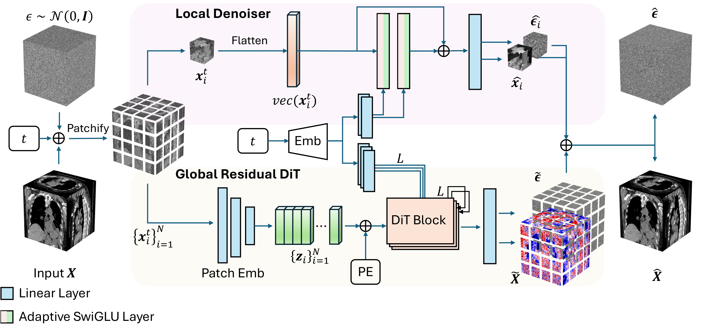

# PRDiT: Pixel-Level Residual Diffusion Transformer for Scalable 3D CT Volume Generation

[](https://openreview.net/forum?id=bWtRZQ1rm2)
[](LICENSE)

Official implementation of **PRDiT** — *Pixel-Level Residual Diffusion Transformer* — a scalable approach for 3D CT volume generation, accepted at **ICLR 2026**.

## 📑 Table of Contents

- [Paper](#paper)
- [Abstract](#abstract)
- [Installation](#installation)
- [Install Dataset](#install-dataset)
- [Training](#training-from-scratch)
- [Sampling](#sampling)
- [Evaluation](#evaluation)
- [Citing](#citing)

## Paper

- **Paper:** [OpenReview](https://openreview.net/forum?id=bWtRZQ1rm2)
- **Poster:** [Link to poster (Coming soon)](#)
- **Project Page:** [Link to project page (Coming soon)](#)

> *Poster and project page links will be added when available.*

## Note 📝

- ➡️ PRDiT architecture implemented [here](#) 📄
- ➡️ Trained models available [here](#) 💻
- ➡️ Training and evaluation code [here](#) ✨

## Updates 🎉

- *Add release milestones and updates here.*

## Abstract

<p align="center">
  
</p>

Generating high-resolution 3D CT volumes with fine details remains challenging due to substantial computational demands and optimization difficulties inherent to existing generative models. In this paper, we propose the Pixel-Level Residual Diffusion Transformer (PRDiT), a scalable generative framework that synthesizes high-quality 3D medical volumes directly at voxel-level. PRDiT introduces a two-stage training architecture comprising 1) a local denoiser in the form of an MLP-based blind estimator operating on overlapping 3D patches to separate low-frequency structures efficiently, and 2) a global residual diffusion transformer employing memory-efficient attention to model and refine high-frequency residuals across entire volumes. This coarse-to-fine modeling strategy simplifies optimization, enhances training stability, and effectively preserves subtle structures without the limitations of an autoencoder bottleneck. Extensive experiments conducted on the LIDC-IDRI and RAD-ChestCT datasets demonstrate that PRDiT consistently outperforms state-of-the-art models, such as HA-GAN, 3D LDM and WDM-3D, achieving significantly lower 3D FID, MMD and Wasserstein distance scores.

## Installation

**Requirements:** Python 3.10+, PyTorch 2.0+, CUDA 11.8+

```bash
# Create conda environment
conda create -n prdit python=3.10
conda activate prdit

# Install PyTorch
pip install torch torchvision torchaudio --index-url https://download.pytorch.org/whl/cu118

pip install -r requirements.txt
```

## Install Dataset

We use **LIDC-IDRI** and **RAD-ChestCT** for our experiments. Prepare the datasets as follows:

### LIDC-IDRI

1. Download the LIDC-IDRI dataset from [The Cancer Imaging Archive (TCIA)](https://wiki.cancerimagingarchive.net/display/Public/LIDC-IDRI).
2. Place the data in `data/LIDC-IDRI/` (or update the path in your config).
3. Preprocess the CT scans:

### RAD-ChestCT

1. Download RAD-ChestCT from the official source [Zenodo](https://zenodo.org/records/6406114#.Ytl6OXbMLAQ).
2. Place the data in `data/RAD-ChestCT/` and run preprocessing.

## Training from Scratch

### Basic Training
```bash
# Single GPU
python train.py --config default.yaml

# Multi-GPU
torchrun --nproc_per_node=4 train.py --config default.yaml

# Resume training
python train.py --config default.yaml --resume_training

# Debug mode
python train.py --config default.yaml --debug
```
### Progressive Training
```bash
# Stage 1: Train Local denoiser module (depth=0)
# Set model.name: "DiT-B/12/0" in config
python train.py --config default.yaml --from_scratch

# Stage 2: Train Global Residual DiT (depth>0)
# Set model.name: "DiT-B/12/4" in config
# Set pretrained_path: "/path/to/stage1/checkpoint.pt"
python train.py --config default.yaml
```

---

## Sampling

```
# Basic sampling
python sample.py --config default.yaml --ckpt $CKPT

# Custom parameters
python sample.py --config default.yaml --new --ckpt $CKPT --num-samples $SAMPLE_NUM --total-samples $STEP_NUM --output-dir $OUTPUT
```
**Output:** NIfTI files saved in specified directory.

## Evaluation

### Compute metrics (3D FID, MMD, Wasserstein distance)

The evaluation procedure runs as follows:

**3D FID Score**

```
python evaluations/fid.py --dataset $DATASET --img_size $IMG_SIZE --data_root_real $DATA_ROOT_REAL --data_root_fake $DATA_ROOT_FAKE --pretrain_path $PRETRAIN_PATH
```

**3D MMD Score**

```
python evaluations/mmd.py --dataset $DATASET --img_size $IMG_SIZE --data_root_real $DATA_ROOT_REAL --data_root_fake $DATA_ROOT_FAKE --pretrain_path $PRETRAIN_PATH
```

**WGAN Critic**

```bash
# Train for Wasserstein distance
python evaluations/wgan_gp.py --seed $SEED --save_path $SAVE_PATH --batch_size $BATCH_SIZE --img_size $IMG_SIZE --gpu_id $GPU_ID --dataset $DATASET --data_root_real $DATA_ROOT_REAL --data_root_fake_0 $DATA_ROOT_FAKE_0 --data_root_fake_1 $DATA_ROOT_FAKE_1 --train_size $TRAIN_SIZE --val_size $VAL_SIZE

# Evaluate for Wasserstein distance
python evaluations/wgan_gp.py --eval --seed $SEED --save_path $SAVE_PATH --batch_size $BATCH_SIZE --img_size $IMG_SIZE --gpu_id $GPU_ID --dataset $DATASET --data_root_real $DATA_ROOT_REAL --data_root_fake_0 $DATA_ROOT_FAKE_0 --data_root_fake_1 $DATA_ROOT_FAKE_1
```

## Citing

If you find this work useful, please consider citing our paper:

```bibtex
@inproceedings{
zhang2026pixellevel,
title={Pixel-Level Residual Diffusion Transformer: Scalable 3D {CT} Volume Generation},
author={Zhenkai Zhang and Markus Hiller and Krista A. Ehinger and Tom Drummond},
booktitle={The Fourteenth International Conference on Learning Representations},
year={2026},
url={https://openreview.net/forum?id=bWtRZQ1rm2}
}
```

## License

This project is released under the [Apache License 2.0](LICENSE).
