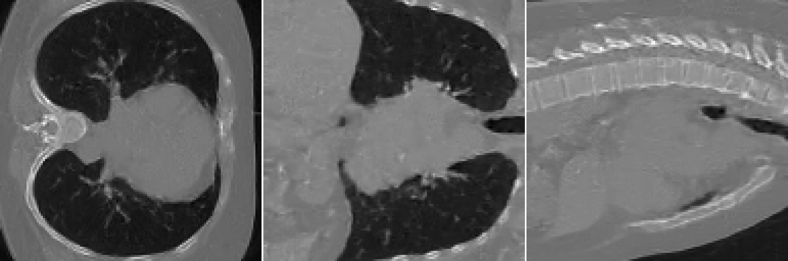
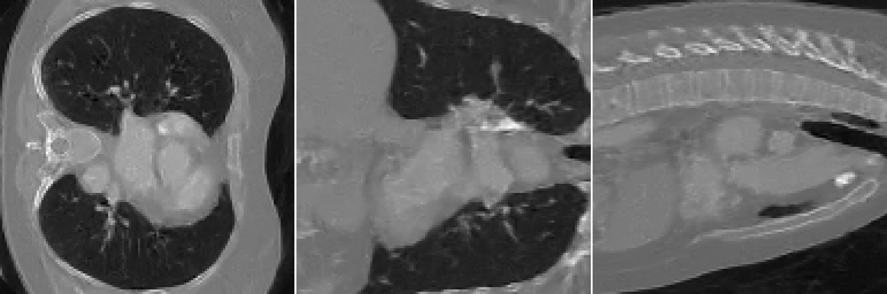
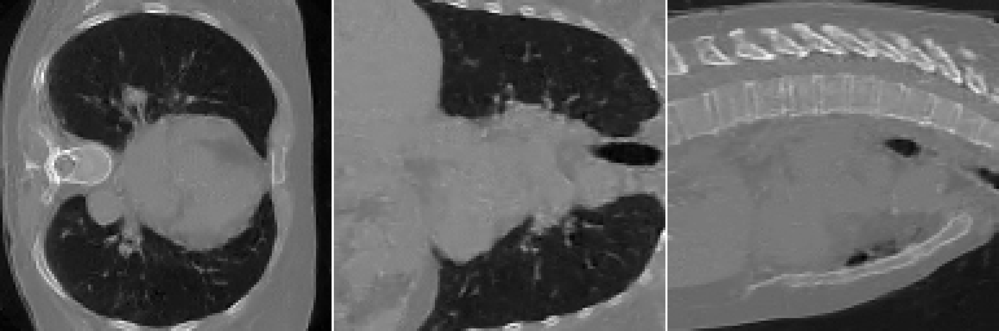
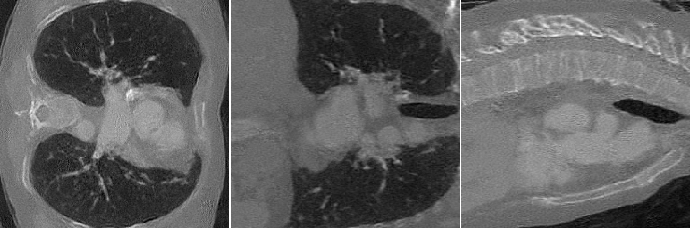
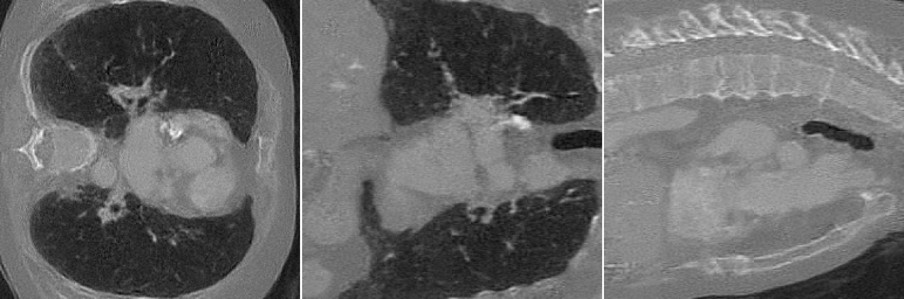
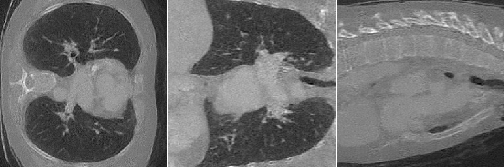
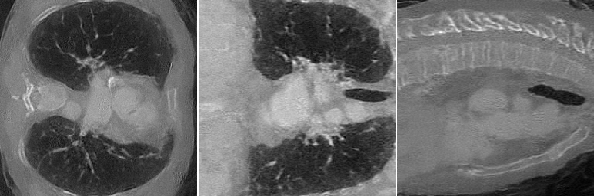
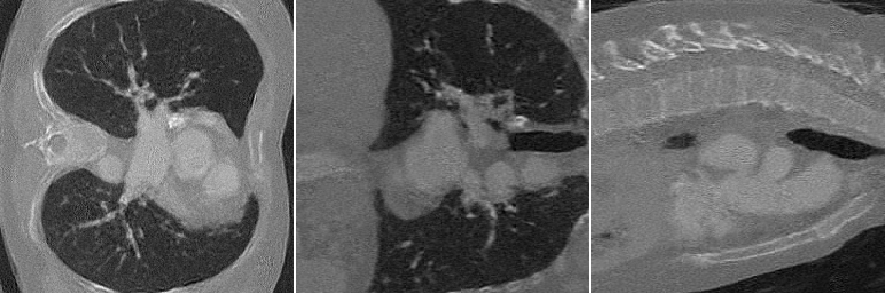
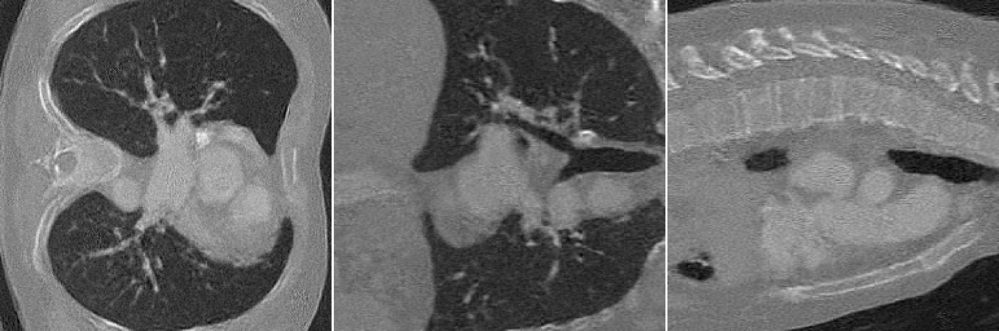

# PRDiT 256³ Flow Matching

This branch extends the baseline [PRDiT](https://github.com/Fredy-Zhang/PRDiT/tree/main)
implementation to native **256 × 256 × 256 CT generation** with Flow Matching.
For the paper, architecture overview, installation, dataset preparation, baseline
training, and citation, see the [baseline README](https://github.com/Fredy-Zhang/PRDiT/blob/main/README.md).

## What changes from the baseline?

| Component | Baseline PRDiT | This 256³ branch |
|---|---|---|
| Volume size | 128³ | 256³ |
| Generative process | IaN diffusion with image/noise heads | Flow Matching with one velocity head |
| Model output channels | 2 | 1 |
| Stage-1 model | `PRDiT-B/12/0` | `PRDiT-B/16/0-s16` |
| Stage-2 model | `PRDiT-B/12/4` | `PRDiT-B/16/12-s16` |
| Stage-2 token grid | Standard stride-8 grid | Stride-16, non-overlapping 16³ patches (4096 tokens) |
| Sampling | Reverse diffusion | ODE solvers: Euler, Heun, RK4, and adaptive Heun |
| Memory controls | Standard training | bfloat16 AMP, gradient accumulation, and optional activation checkpointing |
| Default ODE budget | N/A | 100 Euler steps |

The stride-16 variants keep the stage-2 token sequence at 16³ = 4096 tokens.
This avoids the 32³ = 32768-token sequence that a stride-8 configuration would
produce at 256³ resolution.

## 256³ configuration

The branch provides two LIDC configurations:

- `configs/local/lidc.yaml`: stage 1, `PRDiT-B/16/0-s16`
- `configs/global/lidc.yaml`: stage 2, `PRDiT-B/16/12-s16`

Replace these placeholders before training:

- `{LIDC_DATA_ROOT}`: directory containing the LIDC volumes
- `{STAGE1_CHECKPOINT}`: trained stage-1 checkpoint used by stage 2
- `{WANDB_PROJECT}` and `{WANDB_ENTITY}`: optional; W&B is disabled by default

The 256³ defaults use smaller micro-batches than the baseline:

| Stage | Batch size | Accumulation steps | Effective batch size | AMP | Activation checkpointing |
|---|---:|---:|---:|---|---|
| Stage 1 | 16 | 2 | 32 | bfloat16 | Off |
| Stage 2 | 8 | 4 | 32 | bfloat16 | On |

## Pretrained 256³ stage-2 model

The pretrained stage-2 `PRDiT-B/16/12-s16` checkpoint is available from
[Google Drive](https://drive.google.com/file/d/1hFPNFhbs7gmRBAARa893FUHitQ2VSB_p/view?usp=sharing).
This is the final Flow Matching model used to sample unconditional 256³
generative outputs; it is not a stage-1 checkpoint.

After downloading the checkpoint, generate volumes with:

```bash
python sample.py \
  --config lidc.yaml \
  --ckpt {DOWNLOADED_STAGE2_CHECKPOINT} \
  --solver euler \
  --num-sampling-steps 100 \
  --total-samples {NUM_SAMPLES} \
  --output-dir {OUTPUT_DIR}
```

The model is unconditional (`num_classes: 1` is retained for configuration
compatibility, while sampling passes no class label).

## Training

After following the baseline installation and dataset-preparation instructions:

```bash
# Stage 1: local denoiser
torchrun --nproc_per_node={NUM_GPUS} train.py --config lidc.yaml --from_scratch

# Stage 2: global residual model
# First set model.pretrained_path in configs/global/lidc.yaml.
torchrun --nproc_per_node={NUM_GPUS} train.py --config lidc.yaml
```

The complete two-stage workflow can also be run with:

```bash
bash scripts/run_flow_pipeline.sh
```

## Sampling and solver sweeps

```bash
# Generate 256³ volumes with Flow Matching.
python sample.py \
  --config lidc.yaml \
  --ckpt {MODEL_CHECKPOINT} \
  --solver euler \
  --num-sampling-steps 100 \
  --total-samples {NUM_SAMPLES} \
  --output-dir {OUTPUT_DIR}

# Compare solver/step settings.
CKPT={MODEL_CHECKPOINT} bash scripts/solver_sweep_fm.sh
```

See `python sample.py --help` for the Heun, RK4, adaptive-Heun, `eta`, and
error-target options. The scripts under `scripts/` provide calibration, runtime,
matched-NFE, and FID sweep workflows.

## 128³ vs 256³ outputs

The following unpaired samples use the same Euler 20-step sampler setting and
show the saved `x0` orthogonal views. The 128³ outputs come from the recovered
`solver_sweep/euler_steps_20` run; the 256³ outputs come from the successful
256³ run. Rows are independent generated samples, not the same latent seed or
the same anatomy.

<table>
  <tr>
    <th>Resolution</th>
    <th>Sample 1</th>
    <th>Sample 2</th>
    <th>Sample 3</th>
  </tr>
  <tr>
    <th>128³<br>Euler 20</th>
    <td></td>
    <td></td>
    <td></td>
  </tr>
  <tr>
    <th>256³<br>Euler 20</th>
    <td></td>
    <td></td>
    <td></td>
  </tr>
</table>

| Output property | 128³ | 256³ | Difference |
|---|---:|---:|---:|
| Voxels per axis | 128 | 256 | 2× |
| Voxels per volume | 2,097,152 | 16,777,216 | 8× |
| Raw tensor memory at equal dtype/channels | 1× | 8× | 8× |
| Euler sampling budget shown | 20 NFE | 20 NFE | Matched |

The 256³ output provides twice the sampling density along each spatial axis and
eight times as many voxels per volume. The examples visually expose the denser
image grid, but they do not by themselves establish better distributional or
clinical quality. A controlled comparison requires matched seeds/checkpoints
and quantitative metrics such as 3D FID or MMD.

## Recovered 256³ results

The examples below show the same generated volume using three Euler budgets.
Each image contains orthogonal views of the 256³ output.

<table>
  <tr>
    <th>10 steps / 10 NFE</th>
    <th>50 steps / 50 NFE</th>
    <th>100 steps / 100 NFE</th>
  </tr>
  <tr>
    <td></td>
    <td></td>
    <td></td>
  </tr>
</table>

Each timing setting generated 10 volumes:

| Euler steps | NFE | Total time (s) | Time per volume (s) |
|---:|---:|---:|---:|
| 10 | 10 | 132 | 13.2 |
| 20 | 20 | 108 | 10.8 |
| 40 | 40 | 154 | 15.4 |
| 50 | 50 | 147 | 14.7 |
| 80 | 80 | 192 | 19.2 |
| 100 | 100 | 222 | 22.2 |

These timings were recovered from the successful 256³ run. Hardware metadata
was not recorded and each setting contains only 10 samples, so the table is an
experiment log rather than a controlled benchmark. No completed 3D FID/MMD
summary was present in the recovered sample directory.

Generated outputs are research artifacts and are not intended for clinical use.

## License

This branch follows the baseline project's [Apache License 2.0](LICENSE).
