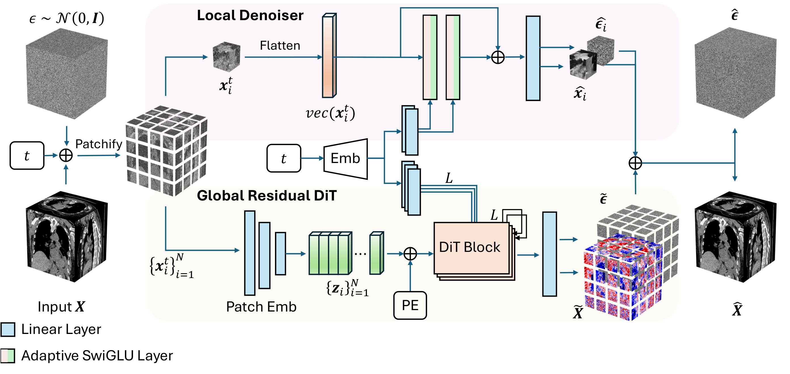

# PRDiT: Pixel-Level Residual Diffusion Transformer for Scalable 3D CT Volume Generation

[](https://openreview.net/forum?id=bWtRZQ1rm2)
[](https://iclr.cc/media/PosterPDFs/ICLR%202026/10008602.png?t=1774447885.2973316)
[](LICENSE)

Official implementation of **PRDiT** — *Pixel-Level Residual Diffusion Transformer* — a scalable approach for 3D CT volume generation, accepted at **ICLR 2026**.

## 📑 Table of Contents

- [Paper](#paper)
- [Updates](#updates-)
- [Abstract](#abstract)
- [Installation](#installation)
- [Install Dataset](#install-dataset)
- [Pretrained Weights](#pretrained-weights)
- [Sampling](#sampling)
- [Training](#training-from-scratch)
- [Evaluation](#evaluation)
- [Citing](#citing)
- [License](#license)

## Paper

- **Paper:** [OpenReview](https://openreview.net/forum?id=bWtRZQ1rm2)
- **Poster:** [ICLR 2026 Poster](https://iclr.cc/media/PosterPDFs/ICLR%202026/10008602.png?t=1774447885.2973316)
- **Project Page:** Coming soon

## Note 📝

- ➡️ PRDiT architecture implemented in [models/](models/) 📄
- ➡️ Pretrained weights and download links available [here](#pretrained-weights) 💻
- ➡️ Training code in [train.py](train.py), sampling code in [sample.py](sample.py), and evaluation code in [evaluations/](evaluations/) ✨

## Updates 🎉

- **2026-10:** Released LIDC-IDRI pretrained weights for PRDiT-B/12/4, PRDiT-B/12/8, and PRDiT-B/12/12 (see [Pretrained Weights](#pretrained-weights)).
- **Coming soon:** RAD-ChestCT pretrained weights (PRDiT-XL/12/4).

## Abstract

<p align="center">
  
</p>

Generating high-resolution 3D CT volumes with fine details remains challenging due to substantial computational demands and optimization difficulties inherent to existing generative models. In this paper, we propose the Pixel-Level Residual Diffusion Transformer (PRDiT), a scalable generative framework that synthesizes high-quality 3D medical volumes directly at voxel-level. PRDiT introduces a two-stage training architecture comprising 1) a local denoiser in the form of an MLP-based blind estimator operating on overlapping 3D patches to separate low-frequency structures efficiently, and 2) a global residual diffusion transformer employing memory-efficient attention to model and refine high-frequency residuals across entire volumes. This coarse-to-fine modeling strategy simplifies optimization, enhances training stability, and effectively preserves subtle structures without the limitations of an autoencoder bottleneck. Extensive experiments conducted on the LIDC-IDRI and RAD-ChestCT datasets demonstrate that PRDiT consistently outperforms state-of-the-art models, such as HA-GAN, 3D LDM and WDM-3D, achieving significantly lower 3D FID, MMD and Wasserstein distance scores.

## Installation

**Requirements:** Python 3.10+, PyTorch 2.0+, CUDA 11.8+

```bash
# Create conda environment
conda create -n prdit python=3.10
conda activate prdit

# Install PyTorch
pip install torch torchvision torchaudio --index-url https://download.pytorch.org/whl/cu118

pip install -r requirements.txt
```

## Install Dataset

We use **LIDC-IDRI** and **RAD-ChestCT** for our experiments.

Detailed dataset download, preprocessing, and split-generation instructions are
available in [datasets/README.md](datasets/README.md).

## Pretrained Weights

We release the final (stage 2) checkpoints for 3D CT volume generation. LIDC-IDRI
checkpoints are available now; RAD-ChestCT weights are coming soon.

| Dataset | Model | Hidden size | Global blocks | Volume size (voxels) | Configuration | Download |
| --- | --- | :---: | :---: | :---: | --- | --- |
| LIDC-IDRI | PRDiT-B/12/4 | 768 | 4 | 128 × 128 × 128 | [lidc.yaml](configs/global/lidc.yaml) | [Google Drive](https://drive.google.com/file/d/1uTQdBGD2xU4L2JGTjWkDG7j2ZXLyEjuw/view?usp=drive_link) |
| LIDC-IDRI | PRDiT-B/12/8 | 768 | 8 | 128 × 128 × 128 | [lidc.yaml](configs/global/lidc.yaml) | [Google Drive](https://drive.google.com/file/d/1zMbG30PQwVNJj-wjT-EmzL8qoEXnYVDU/view?usp=drive_link) |
| LIDC-IDRI | PRDiT-B/12/12 | 768 | 12 | 128 × 128 × 128 | [lidc.yaml](configs/global/lidc.yaml) | [Google Drive](https://drive.google.com/file/d/1XXKRAONiAeyxvTbpbgrLNP87KFFYMEKX/view?usp=drive_link) |
| RAD-ChestCT | PRDiT-XL/12/4 | 1152 | 4 | 128 × 128 × 128 | [rad.yaml](configs/global/rad.yaml) | Coming soon |

Model names follow `PRDiT-{size}/{patch size}/{depth}`: `size` sets the transformer
hidden size (`B` = 768, `XL` = 1152), `patch size` is the edge length of the extracted
3D patches (12 × 12 × 12), and `depth` is the number of global refinement transformer
blocks. A depth of `0` denotes the stage 1 local denoiser on its own.

## Sampling

1. Download a checkpoint from [Pretrained Weights](#pretrained-weights).
2. In [configs/global/lidc.yaml](configs/global/lidc.yaml), keep `data.image_size: 128`
   and set `model.name` to match the checkpoint. The default is `"PRDiT-B/12/4"`;
   change it to `"PRDiT-B/12/8"` or `"PRDiT-B/12/12"` for the other two checkpoints,
   otherwise loading the weights fails.
3. Run `sample.py`. `--config` takes a filename inside `configs/global/`.

```bash
CKPT="/path/to/checkpoint.pt"

# Basic sampling (defaults: 1000 volumes, batches of 4, 1000 sampling steps, output in samples/)
python sample.py --config lidc.yaml --ckpt "$CKPT"

# Custom parameters
python sample.py --config lidc.yaml --ckpt "$CKPT" --new \
    --num-samples $BATCH_SIZE --total-samples $TOTAL_SAMPLES \
    --num-sampling-steps $STEP_NUM --output-dir $OUTPUT
```

| Argument | Default | Description |
| --- | --- | --- |
| `--config` | required | Config filename in `configs/global/` (e.g. `lidc.yaml`) |
| `--ckpt` | required | Path to the checkpoint (`.pt`); EMA weights are used when present |
| `--num-samples` | `4` | Volumes generated per batch |
| `--total-samples` | `1000` | Total number of volumes to generate |
| `--num-sampling-steps` | `1000` | Number of reverse diffusion steps |
| `--output-dir` | `samples` | Output directory |
| `--new` | off | Use the new `p_sample_loop` sampling schema |

**Output:** NIfTI volumes (`.nii.gz`) are written to `$OUTPUT/xs/` (final samples) and
`$OUTPUT/x0/` (predicted clean volumes), each with orthogonal-view PNGs in a
`visualizations/` subfolder.

## Training from Scratch

Use `--config {config_name}` to specify the config filename (e.g., `lidc.yaml`).

The subdirectory (`configs/local/` or `configs/global/`) is automatically selected:
`--from_scratch` resolves to `configs/local/{config_name}` (local denoiser);
omitting it resolves to `configs/global/{config_name}` (global residual PRDiT).

### Basic Training
```bash
# Single GPU
python train.py --config {config}

# Multi-GPU
torchrun --nproc_per_node=4 train.py --config {config}

# Debug mode
python train.py --config {config} --debug
```
### Progressive Training
```bash
# Stage 1: Train Local denoiser module (depth=0)
# Uses configs/local/{config}, e.g. model.name: "PRDiT-B/12/0"
python train.py --config {config} --from_scratch

# Stage 2: Train Global Residual PRDiT (depth>0)
# Uses configs/global/{config}, e.g. model.name: "PRDiT-B/12/4"
# Set model.pretrained_path: "/path/to/stage1/checkpoint.pt"
python train.py --config {config}
```

To skip training, use the released [pretrained weights](#pretrained-weights), which are
the final stage 2 models.

## Evaluation

Evaluation uses a separate environment and, for FID and MMD, a pretrained 3D ResNet-50
from [MedicalNet](https://github.com/Tencent/MedicalNet). Setup, weight download, and
the full argument list are described in [evaluations/README.md](evaluations/README.md).
Run all scripts from the project root, and point the generated-data arguments at a
directory of sampled NIfTI volumes (e.g. `samples/xs`).

**3D FID Score**

```bash
python evaluations/fid.py --dataset $DATASET --img_size $IMG_SIZE --data_root_real $DATA_ROOT_REAL --data_root_fake $DATA_ROOT_FAKE --pretrain_path $PRETRAIN_PATH --path_to_activations $ACTIVATIONS_DIR
```

**3D MMD Score**

```bash
python evaluations/mmd.py --dataset $DATASET --img_size $IMG_SIZE --data_root_real $DATA_ROOT_REAL --data_root_fake $DATA_ROOT_FAKE --pretrain_path $PRETRAIN_PATH --path_to_activations $ACTIVATIONS_DIR
```

**MS-SSIM (diversity)**

```bash
python evaluations/ms_ssim.py --dataset $DATASET --img_size $IMG_SIZE --sample_dir $DATA_ROOT_FAKE
```

`$DATASET` is `lidc-idri` or `rad_chestCT`.

**Wasserstein distance (WGAN-GP critic)**

The critic used for the Wasserstein distance is not included in this repository yet;
it will be released separately. See [evaluations/README.md](evaluations/README.md#w-critic-wasserstein-distance).

## Citing

If you find this work useful, please consider citing our paper:

```bibtex
@inproceedings{
zhang2026pixellevel,
title={Pixel-Level Residual Diffusion Transformer: Scalable 3D {CT} Volume Generation},
author={Zhenkai Zhang and Markus Hiller and Krista A. Ehinger and Tom Drummond},
booktitle={The Fourteenth International Conference on Learning Representations},
year={2026},
url={https://openreview.net/forum?id=bWtRZQ1rm2}
}
```

## License

This project is released under the [Apache License 2.0](LICENSE).
